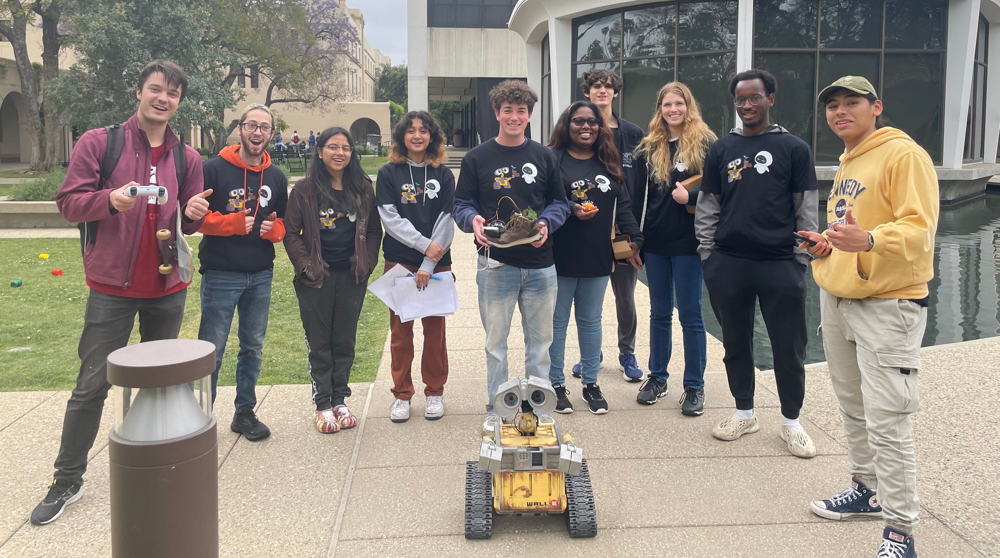

# WALL-E

For Blacker Hovse Ditch Day 2024 (Caltech tradition), we built a ~70% "real-life" size WALL-E robot, that could be **driven remotely with a PS5 controller, move his head and arms, record and transmit a video feed, speak (faintly)**, and he even had a small storage space in his body (for trash of course!).

Here's my video of him when he was at his best (he's currently sitting in a closet in Blacker to be used as a static showcase project, while I study over in Switzerland...): 

https://github.com/user-attachments/assets/6cdb80cf-8617-4d74-ad6d-1ea3f1ae313b

The model we used was https://www.thingiverse.com/thing:3703555, but we scaled it up by 5/3 which introduced a bunch of challenges. 

**! This repository was used for code-sharing and does not aim to make this project repeatable. Maybe in the future...**

## (rough) List of parts

* Rapsberry Pi 4 (Bluetooth)
* PS5 controller
* [RoboClaw 2x15A Motor controller](https://www.basicmicro.com/RoboClaw-2x15A-Motor-Controller_p_10.html)
* [5202 Yellow Jacket Planetary Gear Motor](https://www.gobilda.com/5202-series-yellow-jacket-planetary-gear-motor-26-9-1-ratio-24mm-length-6mm-d-shaft-223-rpm-36mm-gearbox-3-3-5v-encoder/)
* [TowerPro MG996R servos](https://towerpro.com.tw/product/mg996r/)
* [HiLetgo PCA9685 PWM Servo Motor Driver](http://www.hiletgo.com/ProductDetail/2152091.html)
* [Small USB speaker](https://www.amazon.com/shuley-Computer-Speaker-Portable-Sound-bar/dp/B09S3G99HS/ref=sr_1_1)
* some random webcam we found
* 1x 11.1V Zeee LiPo battery (for motor), 1x 7.4V Zee LiPo battery (for servos), some random powerbank (for RPi)

## Some more photos

